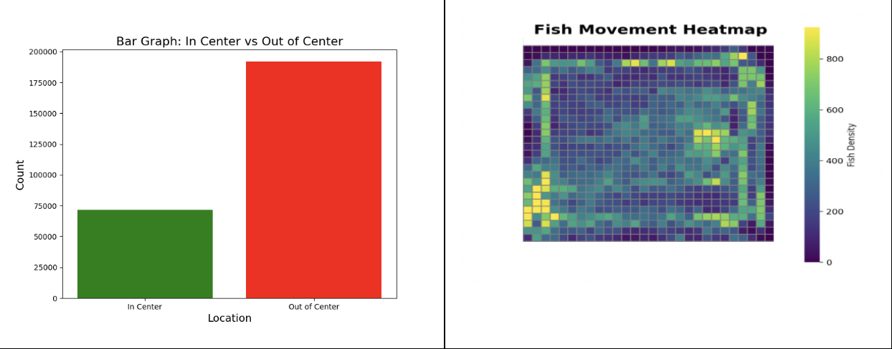

# Alameda County Science and Engineering Fair Files
*Quantitative Analysis of Adaptogenic and Anxiolytic Nootropics’ Effects on Zebrafish Cognition Levels*

Research Project conducted by Vihaan Mehta (Computational Models) and Nehal Revuri (Biology)

My responsibility was to create all computational and data visualization models for the experiments. This included the models of different chemical molecules, the vision algorithm to detect fish position, and the methodology for generating graphs based on data. Additionally, built an Arduino-based circuit, that used enviornmental sensors (water temperature, light, etc.) to collect data.

The analysis below is based upon computational methods outlined in this codebase, with the software for each model being found in different folders and files above. In essence, the study's focus was around the effect of nootropics on fish, and how that would relate to human performance.

### Graph Visualizations
Attached below is a sample of the metric utilized to visualize 12 of the test cases ran, within the form of 4 insightful graphs.

## Methodology Visuals

**NMDA Receptor** ``NMDAReceptor.py``

Below attached is the representation of the L-Theanine molecule after docking with the NMDA Receptor.

**L-Theanine**
``L-Theanine.py``

Individual molecule for L-Theanine, which is a commonly utilized nootropic for enhancing cognitive performance.

**Rhodiola** ``Rhodiola.py``

This was the secondary drug studied throughout the research, with eventually finding little correlation between the drug and enhanced health benefits. 

### Chemical Models
This is a model demonstrated how three different drugs that are studied within this research paper, are predicted to affect human and fish behavior. It outlines the binding affinity between different molecules, and properties of each molecule, and how it relates to the study.

### Vision Algorithm
``ImageLogger.py``
This software simply logged down the images from the camera roll, and stored them in a local image file based on the computer based upon the date. Additionally, there were also timestamps printed on the image for easy clarification.

``ImageTracker.py``

Compared to the Logger software, the tracker software placed a box around the subject to follow it around, and reflected that on the taken images. It was used to track the position, distance, and speed of the subject over periods of time, and this data was stored locally for the test files. It ran on a local Raspberry Pi setup with a camera, placed over the fishtank.

### Testing Data
With ``data1.py`` to ``data12.py``, all of these test cases are the 12 different 10-hour long trials ran using the computer vision model to track the fish's behavior and position on three axes (X, Y, Z) over time.
